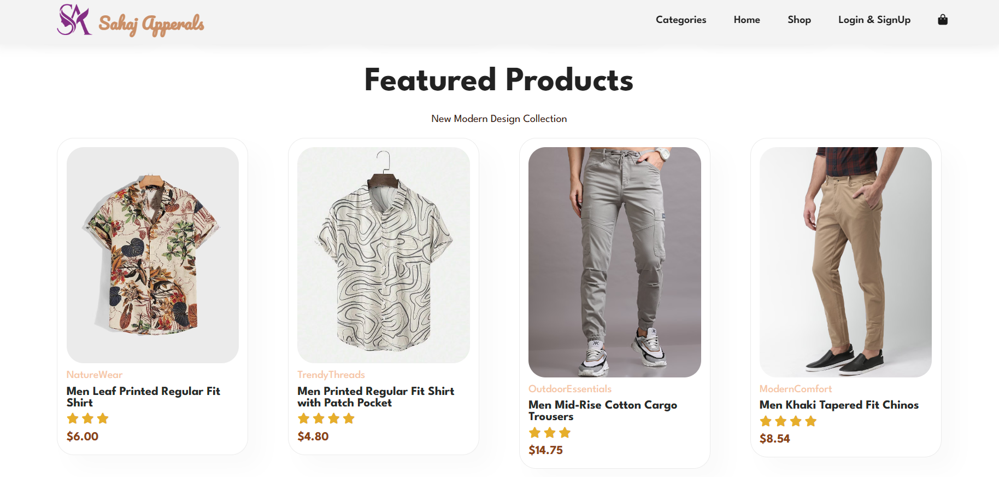
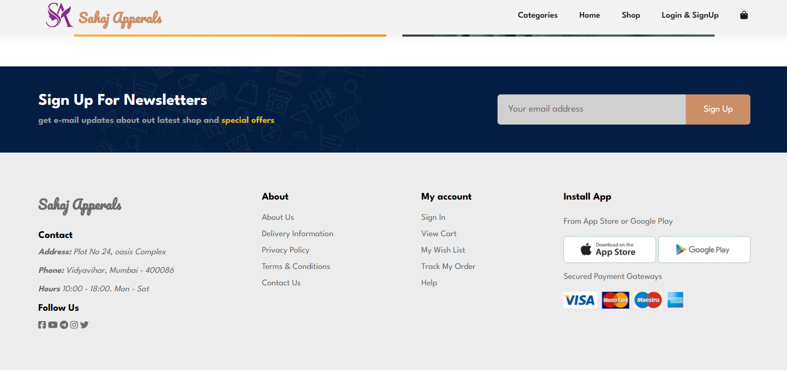
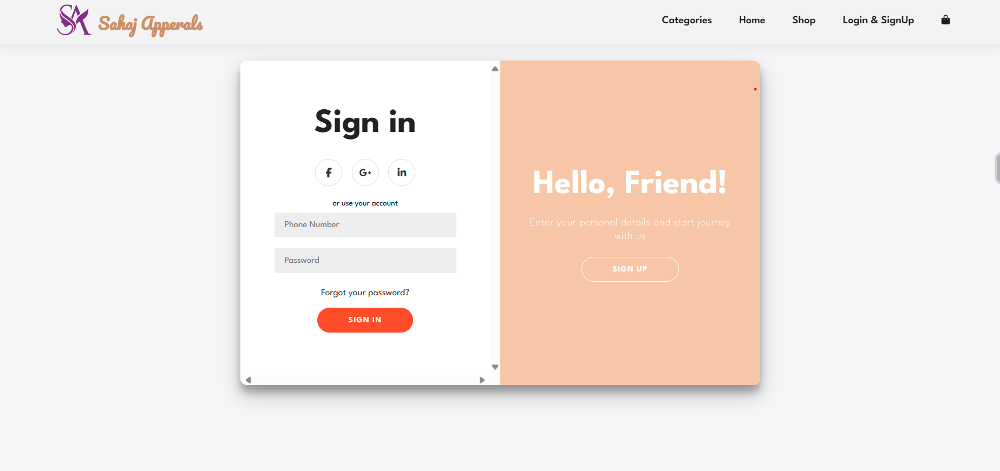
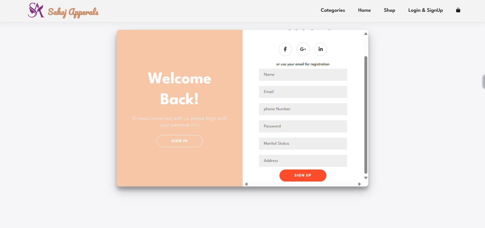
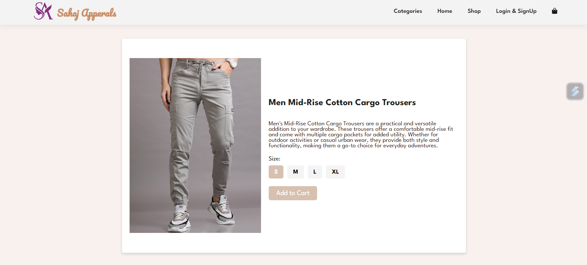
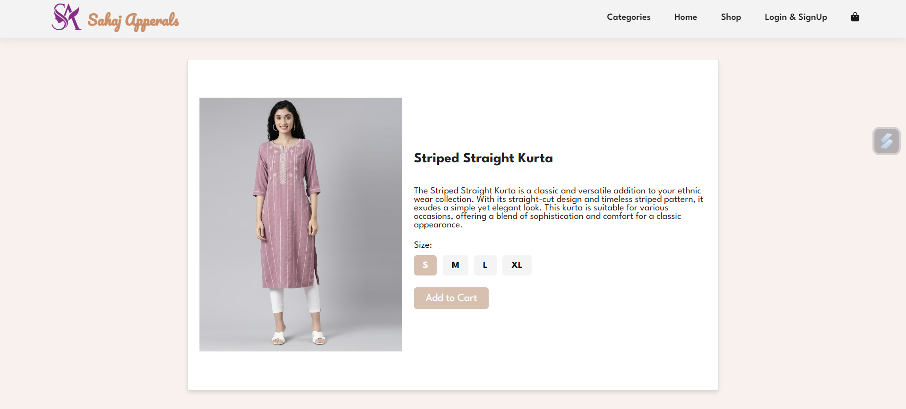

# Sahaj Apparels Backend Project

Welcome to the Sahaj Apparels Clothing Company Backend Project!

This GitHub repository hosts the back-end implementation for Sahaj Apparels, a leading clothing company. Our back-end infrastructure is developed using Java, incorporating JSP (JavaServer Pages) and Servlets, and relies on MySQL for robust database management. For enhanced security, we've implemented password encryption using Argon2d through the Password4j library.

## :rocket: Key Features

- **Java-Powered Backend:** Our project is built with Java, delivering a robust and scalable backend system.

- **Dynamic JSP and Servlets:** We leverage JavaServer Pages and Servlets for dynamic content generation and seamless client-server communication.

- **Efficient MySQL Database:** We've integrated MySQL, a trusted and efficient relational database management system, to handle and manage data with ease.

- **Cutting-Edge Security:** Security is our top priority. Passwords are securely encrypted using Argon2d, a state-of-the-art password hashing algorithm.

## :computer: Getting Started

Explore our project, contribute, and gain insights into creating a powerful and secure back-end for web applications. We encourage collaboration and appreciate your support in enhancing the online experience for Sahaj Apparels' users.

Let's code, collaborate, and create together! :tada:

## :camera: Screenshots

### Homepage

### Login and Signup

### Products

